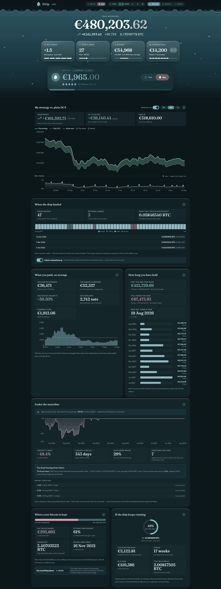
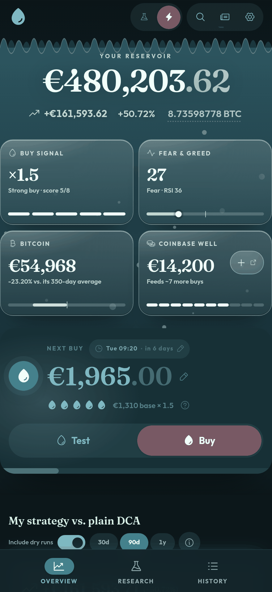
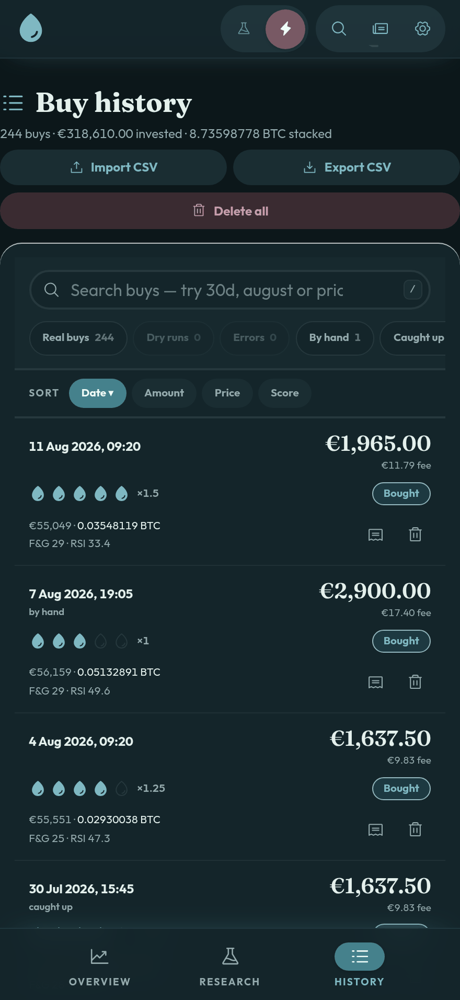
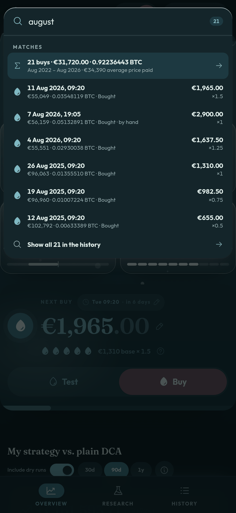
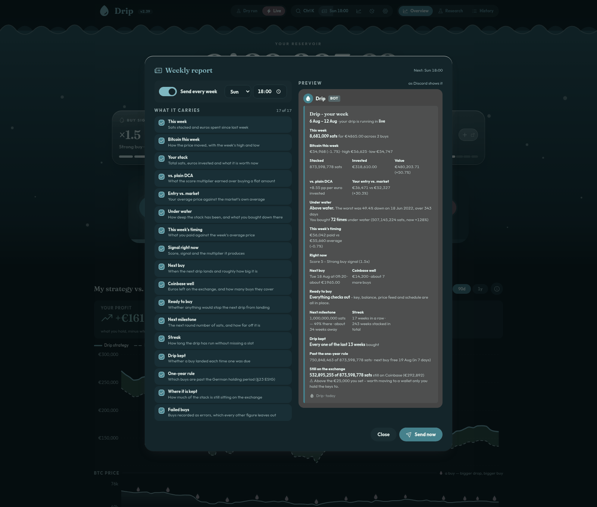

#  Drip

Stack sats on a slow drip. A self-hosted bitcoin savings bot with a web dashboard,
built to run on a Raspberry Pi.

It buys BTC-EUR through the Coinbase Advanced Trade API on the rhythm you pick - daily,
weekly, fortnightly or monthly - and sizes each buy to the market. It **always buys** -
the score only sets the amount. Dry run is the default; live trading is a confirmed
opt-in.



*Example history, not a real account. Night theme; there is a day one too.*

- **Your stack is a tank of water** that fizzes at the strength of the week's signal,
  with four instruments floating on it.
- **The shaded band is the answer**: the distance between what your drip made and what
  buying a flat amount would have. Green while the multiplier is ahead, rose while it
  is not.
- **It checks itself before Monday** - the key, the money, the price feed, the schedule.
  A buy that would not land is said in the top bar, days before the week it would cost.
- **It remembers what you sat through** - how far under water the stack went, and the
  buys you made down there. Those are the cheap ones.
- **It says where the stack is kept**, and how much has moved somewhere only you reach.
- **Underneath**: the strategy audited against itself, what you paid against the market,
  and the weeks the drip landed in - one the Pi slept through is bought when it wakes.
- **Every buy opens** - what those euros are worth today, and the readings behind it.
- **The drip is set where it is read** - click the amount, or the chip with the rhythm,
  the day and the time. Everything else is in the top bar.
- **`Ctrl+K` reaches all of it**, keys included, and searches the buys themselves -
  `august`, `30d`, `price>60000` - answered with how much you put in and what it bought.

## On a phone

<p align="center">
  
  
  
</p>

*One build, both hands: the sections move to a tab bar, figures are set larger rather
than smaller, every card fits them to its own width, the history becomes one card per
buy, and dialogs rise as sheets.*

## Install

Requires 64-bit Raspberry Pi OS with [Docker and the compose plugin](https://docs.docker.com/engine/install/debian/).

```bash
git clone https://github.com/leuteritz/Drip.git
cd Drip
cp backend/.env.example backend/.env   # can stay empty for dry-run mode
docker compose up -d --build
```

The dashboard is then at `http://<pi-address>:8080`; **Setup** takes your keys and
links to the two Coinbase pages you need - where a key is made, and where money goes
in. It also hands you the whole database as one file and takes it back again, so a
Drip moves to another Pi by carrying it over. To update:
`git pull && docker compose up -d --build` - SQLite survives it.

## On a wall

`http://<pi-address>:8080/#tank` is the whole thing on one screen, sized to read across
the room. Point a spare monitor at it and leave it - it refreshes itself and cannot
spend money.

The API has **no authentication** - keep it inside your home network and do not
forward the port to the internet.

## Strategy

Three indicators are scored once a week, and the total picks the multiplier applied to
your base amount.

- **Fear & Greed** - below 25: `+3` · below 45: `+2` · 55 or above: `-2`
- **RSI (14, Wilder)** - below 30: `+3` · below 45: `+1` · above 70: `-2`
- **Price vs. 350-day MA** - below the average: `+2`

| Score | 5 or more | 3 to 4 | 1 to 2 | -1 to 0 | below -1 |
|---|---|---|---|---|---|
| **Buy** | 1.5x | 1.25x | 1.0x | 0.75x | 0.5x |

Tap the drops under the next buy to see the sum.

## Weekly report

Once a week Drip reports itself to Discord: what you stacked, how you stand against
plain DCA, how far under water it has been, where it is kept, and what the signal says
now. Anything that would stop next week's buy - an empty account, a key Coinbase no
longer accepts - is named while there is still time to fix it.

Seventeen sections, each switchable; the preview is built by the code that builds the
real message.



Needs a Discord webhook. Everything else works without one.

## Environment

Secrets go in under **Setup** in the dashboard, or in `backend/.env`; the dashboard
wins. Without Coinbase keys everything still works in dry-run mode.

| Variable | Required | Description |
|---|---|---|
| `COINBASE_API_KEY` | for live trading | Key name from your CDP key file, e.g. `organizations/xxx/apiKeys/yyy`. Create one at https://portal.cdp.coinbase.com/access/api with the Trade permission. |
| `COINBASE_API_SECRET` | for live trading | The EC private key from the same file, on one line with line breaks written as `\n`. |
| `DISCORD_WEBHOOK_URL` | optional | Webhook for buy notifications and the weekly report. |
| `TZ` | optional | Timezone the scheduler runs in, set in `docker-compose.yml`. |
| `DRIP_PORT` | optional | Host port for the dashboard, default 8080. Lives in the **root** `.env`. |

## License

[MIT](LICENSE). This is not financial advice - with live mode enabled the bot trades
real money. Use at your own risk and test in dry-run mode first.
